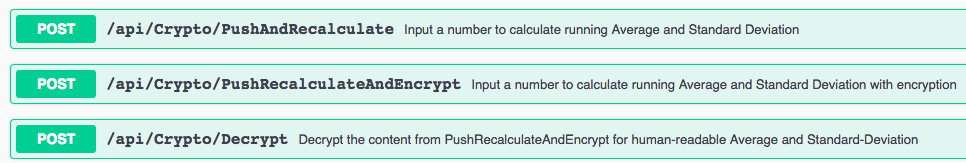

# Goal

Develop a CRYPTO webservice using Symmetric encryption. Primarily, the webservice should be able to 

* calculate and return Average and Standard-Deviation
* calculate and return encrypted Base64-encoded Average and Standard-Deviation
* Decrypt the contents from encrypted Average and Standard-Deviation

# Design

The Crypto service should expose 3 APIs



### Constraints

* The numbers could be coming as an input stream with limited RAM to store them.
* Input number can have zeroes, used *Numbers spreadsheet app as reference*.
## Code Organization

The entire project has been built with **extensibility** in mind. **Dependency Injection** provided by .net-Core framework has been used across the projects. This has helped in swapping components as the project development was evolving.

**Snapshot of parent projects**


### Crypto.Core

Primary project with **interfaces** defined. The core interfaces 

**IMath**

Define the calculation mechanism

```
public interface IMath
{
    MathDto Calculate(long input);
}
```

**ISecure**

Define the security mechanism irrespective of the underlying symmetric algorithm choice.

```
public interface ISecure
{
    string Encrypt(string text);
    string Decrypt(string data);
}
```

**MathDto**

Return object for the calculations

```
public class MathDto
{
    public double Average{ get; set;   }
    public double StandardDeviation{ get; set; }
}
```

**MathSecureDto**

Just like above, however encrypted data. Certain characters

* '+'
* '/'
* '='

has to be handled carefully over the wire. These chracters has to be escaped and sent to decryption, to avoid unforeseen errors.

This object has 2 variations of the same encrypted data:

* HTTP encoded Base64 encoded string
* Regular Base64 encoded string

```
public class MathSecureDto
{
    public string HTTPEncodedAverage { get; set; }
    public string HTTPEncodedStandardDeviation { get; set; }
    public string Average { get; set; }
    public string StandardDeviation { get; set; }
}
```
#### Crypto.Math

Evaluation for average and standard-deviation. Multiple implementations of `Evaluate` was implemented in the course of evolving the project. 

The **first** implementation `SimpleDictCalc` uses a *Dictionary* object to do a naive calculation. The dictionary object would store an incoming number with count. As repetative numbers come the counter would be incremented. However, upon testing with a simple data-set, the implementation works great! As data-set increases, the performance would be degraded. Evidently, the limited memory constraint would have been compromised.

The **second** implementation `SimpleCalc` does not store any incoming values, but follows the logic from the [stackoverflow article](https://stackoverflow.com/questions/10365119/mean-value-and-standard-deviation-of-a-very-huge-data-set).

The formula to calculate is

```
mean = sum_x / n
stdev = sqrt( sum_x2/n - mean^2 )
```

However, caveats to implementing this formula would lead to dealing with overflow and/or limited precision. We can see this if we consider floating point when sum_x2 is so large that the internal representation doesn't include values of the magnitude of a single squared value. A simple way to avoid the problem is to use exact arithmetic, but that will be increasingly slow (and also uses O(log(n)) memory).

The **final** implementation is the most **optimal**!
From the article above, there were pointers to *Donald E. Knuth*'s algorithm. More details can be found [here](https://en.wikipedia.org/wiki/Algorithms_for_calculating_variance). The implementation can be found in `RunningStatsCalc`. The **very large dataset** was able to complete the computation in a reasonable time.
#### Crypto.Secure

The implementation for Encrypting and Decrypting the data can be seen here. Among a few Symmetric encryption algorithm's available in .net, I have used AES (Advanced Encryption Standard). While the Secure services start, the **Key** and **Initialization Vector (IV)** would be cached. Both the *Key* and *IV* would be consumed over the lifetime of the application. If the end-user had encrypted a string and stopped the application, chances are the decryption logic might fail, since the *Key* and *IV* was recreated on the subsequent start-up of the application.

The output from `Encrypt` is *Base64* encoded string of the encrypted byte stream.

The output from `Decrypt` takes in *Base64* encoded string and returns the decoded text.

#### Crypto.Test

Unit-testing for the projects can be found here. In addition, for testing, I have included

* data-set *10,000 numbers*
* large data-set *65,400 numbers*

#### CryptoService

This project ties in the implemenation from all the above projects and expose the functionality as REST endpoints. The project consumes *Swagger*. This gives the end-user to invoke the REST end-points from the browser itself, to test functionality. The request can be invoked from the browser, the response can be viewed from the browser as well.

## Example usage

| Operation | Result |
| :-------- | :------|
| PushAndRecalculate(4) | *Average* 4 *SD* 0 |
| PushAndRecalculate(7) | *Average* 5.5 *SD* 1.5 |
| PushAndRecalculate(6) | *Average* 5.667 *SD* 1.247 |
| PushRecalculateAndEncrypt(6) | *Average* encrypted(6.5) *SD* encrypted(1.802) |
| Decrypt(encrypted(6.5)) | *Average* 6.5 |
| Decrypt(encrypted(1.802)) | *SD* 1.802 |
| PushAndRecalculate(1) | *Average* 5.4 *SD* 2.728 |

# Deployment
## Direct deploy

The container is published in [docker registry](https://hub.docker.com/r/subramp/awesome-crypto). To deploy the container on a host machine with docker installed, follow the command

```
docker run -d -p 5000:80 --name crypto subramp/awesome-crypto:latest
```

After deploying the container the user could go to browser to

```
http://localhost:5000/swagger
```

to view the endpoints.
## Build and Deploy
The app is designed with portability in mind. The .net-core app *src* folder contains a **Dockerfile** with specifications on how to build the app.

To build a docker container, go to the project *src* folder from command-line and run the below command
```
docker build -t cryptoapp .
```
The command downloads 

```
microsoft/dotnet  2.1-aspnetcore-runtime
microsoft/dotnet  2.1-sdk 
```

containers to baseline the image requirements and build the final **cryptoapp** image. The *Dockerfile* cleans, builds and containerizes the project. The command below should deploy the container

```
docker run -d -p 5000:80 --name awesome-crypto cryptoapp
``` 

The above command would bind to port 5000 on the host machine. Please make sure, no other services are listening on port 5000. After deploying can browse the services at

```
http://localhost:5000/swagger
```

The REST end-points from the landing page can be invoked individually from the **browser itself.** No additional client required.

## Landing page

Each end-point can be invoked individually.


## Technical Details

|  Details | Specification |
| :----- | :---------|
| Symmetric encryption | AES |
| Language | C# |
| Hosting framework| .net Core (Kestrel)|
| REST API Documentation | Swagger |
| Deployment | Docker |
| Unit testing framework | xUnit |

## Snapshot of all projects and all files


## References

* [Selection of Symmetric algorithm](https://en.wikipedia.org/wiki/Symmetric-key_algorithm)
* [AES for C#](https://docs.microsoft.com/en-us/dotnet/standard/security/cryptography-model)
* [Optimized Average & SD computation](https://www.johndcook.com/blog/skewness_kurtosis/)
* [Memory management for large data-set](https://alex.dzyoba.com/blog/external-sort/)
* [Swagger documentation for end-points](https://docs.microsoft.com/en-us/aspnet/core/tutorials/getting-started-with-swashbuckle)
* [Dataset for testing](http://eforexcel.com/wp/downloads-18-sample-csv-files-data-sets-for-testing-sales/)
* [Dependency Injection](https://docs.microsoft.com/en-us/aspnet/core/fundamentals/dependency-injection)